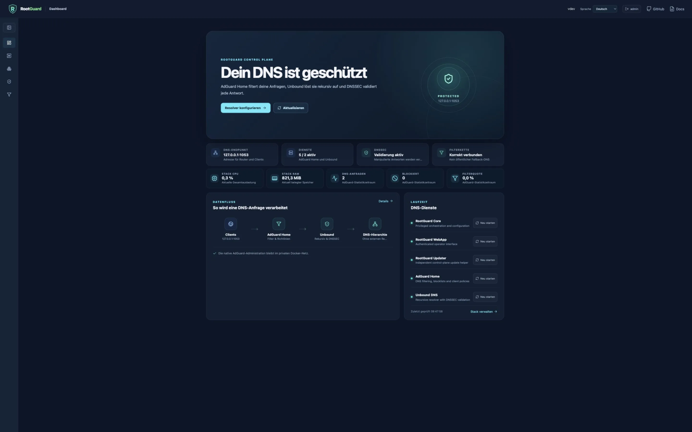
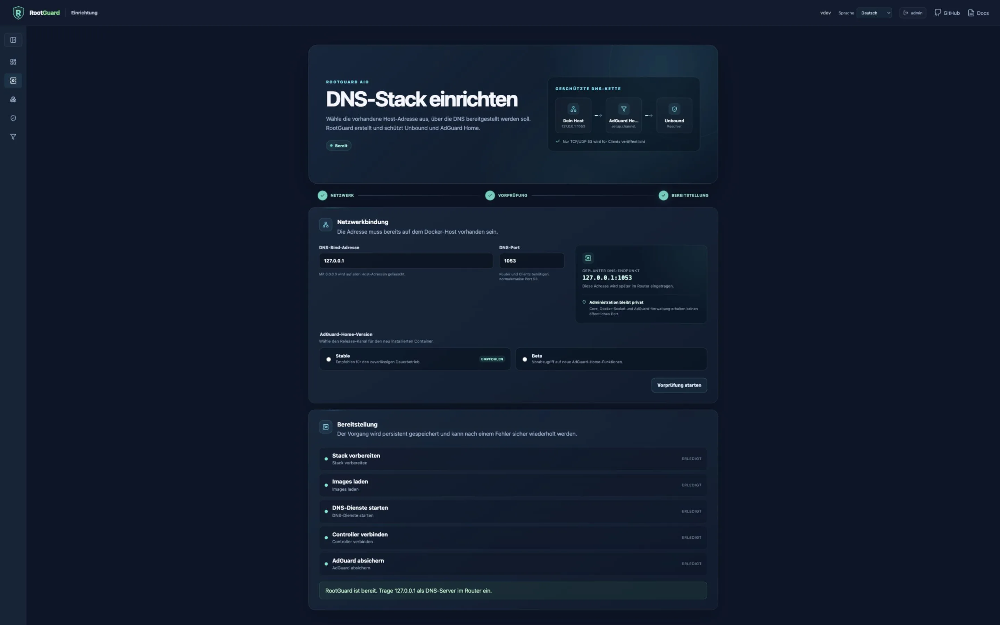

# RootGuard — Self-hosted DNS protection

[Deutsch](#deutsch) · [English](#english)


## Product preview

These screenshots show a verified local development stack with the documented
default account and loopback-only DNS endpoint. No real network or access data
is included.





<a id="deutsch"></a>

## Deutsch

**RootGuard schützt alle Geräte in deinem Netzwerk zentral vor Werbung und
bekannten Trackern.** Eine übersichtliche Weboberfläche verbindet dafür
[AdGuard Home](https://github.com/AdguardTeam/AdGuardHome) mit einem eigenen
rekursiven [Unbound](https://github.com/NLnetLabs/unbound)-Resolver – als
vollständiger, selbst betriebener Docker-Compose-Stack für netzwerkweite
DNS-Filterung, rekursive DNS-Auflösung und DNSSEC-Validierung.

[](https://github.com/foxly-it/rootguard/releases)
[](https://github.com/foxly-it/rootguard/actions/workflows/ci.yml)
[](LICENSE)
[](https://rootguard.foxly.de/)

[Website](https://rootguard.foxly.de/) ·
[Handbuch](https://rootguard.foxly.de/docs.html) ·
[Roadmap](https://rootguard.foxly.de/roadmap.html) ·
[Releases](https://github.com/foxly-it/rootguard/releases)

> [!IMPORTANT]
> RootGuard befindet sich in der öffentlichen Release-Candidate-Phase vor 1.0.
> Die Version ist zum Ausprobieren und für reproduzierbare Rückmeldungen
> gedacht. Sie ist noch nicht für den Einsatz als einziger DNS-Dienst in einer
> Produktivumgebung vorgesehen.

## Warum RootGuard?

Ein DNS-Filter kann Werbung und Tracker für Fernseher, Smartphones,
Spielekonsolen und Computer blockieren, ohne auf jedem Gerät eine Erweiterung
zu installieren. RootGuard ergänzt diese Filterung um einen eigenen Resolver
und eine gemeinsame Bedienoberfläche.

- **Netzwerkweite Filterung:** AdGuard Home stoppt unerwünschte DNS-Anfragen.
- **Eigene DNS-Auflösung:** Unbound fragt die DNS-Hierarchie rekursiv ab und
  validiert DNSSEC.
- **Zentrale Verwaltung:** Setup, Konfiguration, Updates und Rollbacks laufen
  über die RootGuard-Weboberfläche.
- **Geführtes lokales DNS:** Lokale Einträge, private Domains, Conditional
  Forwarding und sichere RFC1918-Reverse-Zonen kommen ohne rohe
  Unbound-Konfiguration aus.
- **Self-hosted und offen:** Daten und Kontrolle bleiben auf dem eigenen
  Docker-Host; der Quellcode ist unter AGPL-3.0-or-later verfügbar.

```text
Geräte im Netzwerk → AdGuard Home → Unbound → DNS-Hierarchie
                         Filter       DNSSEC
```

## Quick Start

Voraussetzung ist ein Rechner mit Docker Compose v2. Die öffentliche
Release-Candidate-Phase verwendet fertige Images für `amd64` und `arm64`; ein
lokaler Build ist nicht notwendig.

```sh
mkdir rootguard && cd rootguard
curl -LO https://raw.githubusercontent.com/foxly-it/rootguard/v1.0.0-rc.2/compose.release.yaml
curl -Lo .env https://raw.githubusercontent.com/foxly-it/rootguard/v1.0.0-rc.2/.env.release.example
```

Erzeuge zwei voneinander unabhängige Sicherheitsschlüssel:

```sh
openssl rand -hex 32
openssl rand -hex 32
```

Trage in `.env` ein eigenes starkes `ROOTGUARD_ADMIN_PASSWORD` sowie die beiden
Werte getrennt als `ROOTGUARD_API_TOKEN` und `ROOTGUARD_RECOVERY_TOKEN` ein.
Starte anschließend den Stack:

```sh
docker compose -f compose.release.yaml up -d
```

Öffne `http://<IP-des-Docker-Hosts>:8080/login` und folge dem geführten Setup.
Dabei kannst du zwischen dem empfohlenen Stable-Kanal und einer ausdrücklich
als experimentell gekennzeichneten AdGuard-Home-Beta wählen. Beta kann Fehler
enthalten; DNS-Auflösung und Blocking dürfen deshalb nicht als ausfallsicher
betrachtet werden.
Die vollständigen Voraussetzungen, Router-Einrichtung und Fehlerbehebung stehen
im [Handbuch](https://rootguard.foxly.de/docs.html#quickstart).

## Was ist enthalten?

| Komponente | Aufgabe |
| --- | --- |
| **RootGuard WebApp** | Login, Dashboard und geführte Bedienung |
| **RootGuard Core** | Orchestrierung und geprüfte Konfigurationsänderungen |
| **RootGuard Updater** | Gemeinsame Core-/WebApp-Updates mit Rollback |
| **AdGuard Home** | Netzwerkweite DNS-Filterung |
| **Unbound** | Rekursive DNS-Auflösung und DNSSEC-Validierung |

Die [Live-Produktansicht](https://rootguard.foxly.de/) zeigt die aktuelle
Oberfläche. Architektur, Vertrauensgrenzen und Update-Abläufe sind bewusst aus
diesem Einstieg ausgelagert:

- [Installation und Betrieb](https://rootguard.foxly.de/docs.html)
- [Architektur](docs/architecture.md)
- [Aktueller Projektstand](docs/project-state.md)
- [Roadmap bis 1.0](ROADMAP.md)
- [Changelog](CHANGELOG.md)
- [Image-Digests und Aufbewahrungsregeln](docs/image-retention-policy.md)
- [Geprüfte Installationsplattformen](docs/platform-support.md)
- [Performance- und Speicher-Baseline](docs/performance-baseline.md)
- [Barrierefreiheits- und Sicherheits-Review](docs/accessibility-security-review.md)

## Entwicklung

RootGuard ist ein Monorepo. Für Änderungen am gesamten Projekt reicht ein
einfacher Klon:

```sh
git clone https://github.com/foxly-it/rootguard.git
cd rootguard
cp .env.example .env
docker compose up --build -d
```

Die Komponenten sind eigenständig baubare Verzeichnisse im selben Repository:

| Verzeichnis | Verantwortung |
| --- | --- |
| [`rootguard-core`](rootguard-core) | Control Plane und DNS-Orchestrierung |
| [`rootguard-webapp`](rootguard-webapp) | Weboberfläche und Sitzungsverwaltung |
| [`rootguard-updater`](rootguard-updater) | Kontrollierte Control-Plane-Updates |
| [`rootguard-unbound`](rootguard-unbound) | Gehärtetes Unbound-Image |
| [`rootguard-blockpage`](rootguard-blockpage) | Landingpage für geblockte Anfragen |

Die vormaligen eigenständigen Repositories sind archiviert und weiterhin
lesbar (Historie, alte Issues/PRs); aktive Entwicklung findet nur noch hier
statt.

## Mitwirken

Beiträge, Tests und verständliche Dokumentation sind willkommen. Der
[Beitragsleitfaden](CONTRIBUTING.md) erklärt Entwicklungssetup, Zuständigkeiten,
Tests und Pull Requests.

Ein guter Einstieg sind Issues mit
[`good first issue`](https://github.com/foxly-it/rootguard/labels/good%20first%20issue)
oder [`help wanted`](https://github.com/foxly-it/rootguard/labels/help%20wanted).
Sicherheitsprobleme bitte nicht öffentlich melden, sondern den Hinweisen in
[SECURITY.md](SECURITY.md) folgen.

## Lizenz und Marke

RootGuard ist freie Software unter
[GNU AGPL-3.0-or-later](LICENSE). Hinweise zur Nutzung der Namen und Logos von
RootGuard und Foxly IT stehen in [TRADEMARKS.md](TRADEMARKS.md).

---

<a id="english"></a>

## English

**RootGuard centrally protects every device on your network from ads and known
trackers.** Its approachable web interface combines
[AdGuard Home](https://github.com/AdguardTeam/AdGuardHome) with a private,
recursive [Unbound](https://github.com/NLnetLabs/unbound) resolver in one
self-hosted Docker Compose stack for network-wide DNS filtering, recursive DNS,
and DNSSEC validation.

[Website](https://rootguard.foxly.de/) ·
[Documentation](https://rootguard.foxly.de/docs.html) ·
[Roadmap](https://rootguard.foxly.de/roadmap.html) ·
[Releases](https://github.com/foxly-it/rootguard/releases)

> [!IMPORTANT]
> RootGuard is in public release-candidate testing ahead of 1.0, intended for
> evaluation and reproducible feedback. It is not yet recommended as the only
> DNS service for a production network.

### Why RootGuard?

A DNS filter can block ads and trackers for TVs, smartphones, game consoles,
computers, and IoT devices without installing an extension on every device.
RootGuard adds a private recursive resolver and one coherent management
interface.

- **Network-wide ad and tracker blocking:** AdGuard Home filters unwanted DNS
  requests before they reach your devices.
- **Private recursive DNS:** Unbound resolves names through the DNS hierarchy
  and validates DNSSEC signatures.
- **Unified management:** Guided setup, configuration, updates, health checks,
  diagnostics, and rollbacks live in the RootGuard WebGUI.
- **Guided local DNS:** Manage local records, private domains, conditional
  forwarding, and RFC1918 reverse zones without editing raw Unbound files.
- **Self-hosted and open source:** Data and control remain on your Docker host;
  the source is available under AGPL-3.0-or-later.

```text
Network devices → AdGuard Home → Unbound → DNS hierarchy
                       filtering      DNSSEC
```

### Quick start

RootGuard requires Docker Compose v2. The public release-candidate phase
provides ready-made `amd64` and `arm64` container images, so no local build is
required.

```sh
mkdir rootguard && cd rootguard
curl -LO https://raw.githubusercontent.com/foxly-it/rootguard/v1.0.0-rc.2/compose.release.yaml
curl -Lo .env https://raw.githubusercontent.com/foxly-it/rootguard/v1.0.0-rc.2/.env.release.example
```

Generate two independent random security tokens:

```sh
openssl rand -hex 32
openssl rand -hex 32
```

Set a strong `ROOTGUARD_ADMIN_PASSWORD` in `.env` and use the generated values
separately for `ROOTGUARD_API_TOKEN` and `ROOTGUARD_RECOVERY_TOKEN`. Then start
the stack:

```sh
docker compose -f compose.release.yaml up -d
```

Open `http://<docker-host-ip>:8080/login` and follow the guided setup. The setup
offers the recommended Stable channel and an explicitly experimental
AdGuard Home Beta channel. Beta may contain bugs; DNS resolution and blocking
must not be treated as fail-safe when it is selected. See the
[installation guide](https://rootguard.foxly.de/docs.html#quickstart) for
requirements, router configuration, upgrades, and troubleshooting.

### Included components

| Component | Responsibility |
| --- | --- |
| **RootGuard WebApp** | Login, dashboard, and guided management |
| **RootGuard Core** | Orchestration and validated configuration changes |
| **RootGuard Updater** | Coordinated Core/WebApp updates with rollback |
| **AdGuard Home** | Network-wide DNS filtering |
| **Unbound** | Recursive DNS resolution and DNSSEC validation |

Further technical information:

- [Architecture and trust boundaries](docs/architecture.md)
- [Current project state](docs/project-state.md)
- [Roadmap to 1.0](ROADMAP.md)
- [Changelog](CHANGELOG.md)
- [Image digests and retention policy](docs/image-retention-policy.md)
- [Verified installation platforms](docs/platform-support.md)
- [Performance and memory baseline](docs/performance-baseline.md)
- [Accessibility and security review](docs/accessibility-security-review.md)

### Development and contributions

RootGuard is a monorepo, so a plain clone is enough:

```sh
git clone https://github.com/foxly-it/rootguard.git
cd rootguard
cp .env.example .env
docker compose up --build -d
```

Contributions, testing, and clear documentation are welcome. Read
[CONTRIBUTING.md](CONTRIBUTING.md) before opening a pull request. Report
security vulnerabilities privately by following [SECURITY.md](SECURITY.md).

### License and trademark

RootGuard is free and open-source software licensed under
[GNU AGPL-3.0-or-later](LICENSE). See [TRADEMARKS.md](TRADEMARKS.md) for the
RootGuard and Foxly IT name and logo policy.
