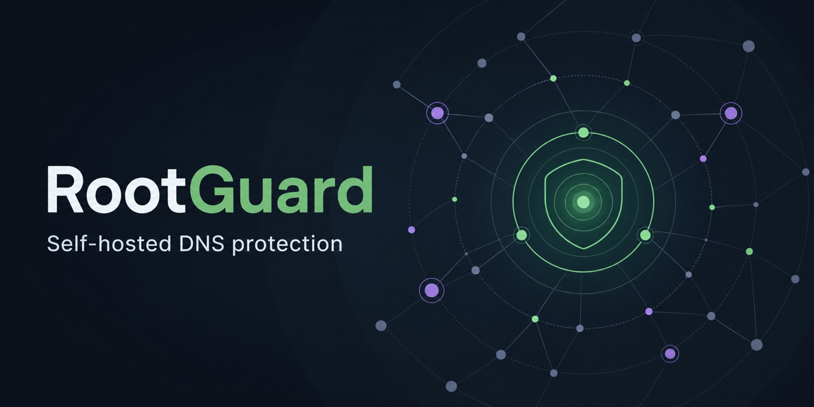

# RootGuard



**RootGuard schützt alle Geräte in deinem Netzwerk zentral vor Werbung und
bekannten Trackern.** Eine übersichtliche Weboberfläche verbindet dafür
[AdGuard Home](https://github.com/AdguardTeam/AdGuardHome) mit einem eigenen
rekursiven [Unbound](https://github.com/NLnetLabs/unbound)-Resolver – als
vollständiger, selbst betriebener Docker-Stack.

[](https://github.com/foxly-it/rootguard/releases)
[](https://github.com/foxly-it/rootguard/actions/workflows/ci.yml)
[](LICENSE)
[](https://rootguard.foxly.de/)

[Website](https://rootguard.foxly.de/) ·
[Handbuch](https://rootguard.foxly.de/docs.html) ·
[Wiki](https://rootguard.foxly.de/wiki.html) ·
[Roadmap](https://rootguard.foxly.de/roadmap.html) ·
[Releases](https://github.com/foxly-it/rootguard/releases)

> [!IMPORTANT]
> RootGuard befindet sich in einer öffentlichen Alpha. Die Version ist zum
> Ausprobieren und für reproduzierbare Rückmeldungen gedacht, noch nicht als
> Produktionsempfehlung für den einzigen DNS-Dienst eines gesamten Netzwerks.

## Warum RootGuard?

Ein DNS-Filter kann Werbung und Tracker für Fernseher, Smartphones,
Spielekonsolen und Computer blockieren, ohne auf jedem Gerät eine Erweiterung
zu installieren. RootGuard ergänzt diese Filterung um einen eigenen Resolver
und eine gemeinsame Bedienoberfläche.

- **Netzwerkweite Filterung:** AdGuard Home stoppt unerwünschte DNS-Anfragen.
- **Eigene DNS-Auflösung:** Unbound fragt die DNS-Hierarchie rekursiv ab und
  validiert DNSSEC.
- **Zentrale Verwaltung:** Setup, Konfiguration, Updates und Rollbacks laufen
  über die RootGuard-Weboberfläche.
- **Self-hosted und offen:** Daten und Kontrolle bleiben auf dem eigenen
  Docker-Host; der Quellcode ist unter AGPL-3.0-or-later verfügbar.

```text
Geräte im Netzwerk → AdGuard Home → Unbound → DNS-Hierarchie
                         Filter       DNSSEC
```

## Quick Start

Voraussetzung ist ein Rechner mit Docker Compose v2. Die öffentliche Alpha
verwendet fertige Images für `amd64` und `arm64`; ein lokaler Build ist nicht
notwendig.

```sh
mkdir rootguard-alpha && cd rootguard-alpha
curl -LO https://raw.githubusercontent.com/foxly-it/rootguard/v0.1.0-alpha.2/compose.alpha.yaml
curl -Lo .env https://raw.githubusercontent.com/foxly-it/rootguard/v0.1.0-alpha.2/.env.alpha.example
```

Erzeuge zwei voneinander unabhängige Sicherheitsschlüssel:

```sh
openssl rand -hex 32
openssl rand -hex 32
```

Trage in `.env` ein eigenes starkes `ROOTGUARD_ADMIN_PASSWORD` sowie die beiden
Werte getrennt als `ROOTGUARD_API_TOKEN` und `ROOTGUARD_RECOVERY_TOKEN` ein.
Starte anschließend den Stack:

```sh
docker compose -f compose.alpha.yaml up -d
```

Öffne `http://<IP-des-Docker-Hosts>:8080/login` und folge dem geführten Setup.
Die vollständigen Voraussetzungen, Router-Einrichtung und Fehlerbehebung stehen
im [Handbuch](https://rootguard.foxly.de/docs.html#quickstart).

## Was ist enthalten?

| Komponente | Aufgabe |
| --- | --- |
| **RootGuard WebApp** | Login, Dashboard und geführte Bedienung |
| **RootGuard Core** | Orchestrierung und geprüfte Konfigurationsänderungen |
| **RootGuard Updater** | Gemeinsame Core-/WebApp-Updates mit Rollback |
| **AdGuard Home** | Netzwerkweite DNS-Filterung |
| **Unbound** | Rekursive DNS-Auflösung und DNSSEC-Validierung |

Die [Live-Produktansicht](https://rootguard.foxly.de/) zeigt die aktuelle
Oberfläche. Architektur, Vertrauensgrenzen und Update-Abläufe sind bewusst aus
diesem Einstieg ausgelagert:

- [Installation und Betrieb](https://rootguard.foxly.de/docs.html)
- [Architektur](docs/architecture.md)
- [Aktueller Projektstand](docs/project-state.md)
- [Roadmap bis 1.0](ROADMAP.md)
- [Release Notes v0.1.0-alpha.2](RELEASE_NOTES_0.1.0-alpha.2.md)

## Entwicklung

Für Änderungen am gesamten Projekt wird das Repository mit seinen
Komponenten-Submodules geklont:

```sh
git clone --recurse-submodules https://github.com/foxly-it/rootguard.git
cd rootguard
cp .env.example .env
docker compose up --build -d
```

Die Komponenten bleiben eigenständige Repositories:

| Repository | Verantwortung |
| --- | --- |
| [`rootguard-core`](https://github.com/foxly-it/rootguard-core) | Control Plane und DNS-Orchestrierung |
| [`rootguard-webapp`](https://github.com/foxly-it/rootguard-webapp) | Weboberfläche und Sitzungsverwaltung |
| [`rootguard-updater`](https://github.com/foxly-it/rootguard-updater) | Kontrollierte Control-Plane-Updates |
| [`rootguard-unbound`](https://github.com/foxly-it/rootguard-unbound) | Gehärtetes Unbound-Image |

## Mitwirken

Beiträge, Tests und verständliche Dokumentation sind willkommen. Der
[Beitragsleitfaden](CONTRIBUTING.md) erklärt Entwicklungssetup, Zuständigkeiten,
Tests und Pull Requests.

Ein guter Einstieg sind Issues mit
[`good first issue`](https://github.com/foxly-it/rootguard/labels/good%20first%20issue)
oder [`help wanted`](https://github.com/foxly-it/rootguard/labels/help%20wanted).
Sicherheitsprobleme bitte nicht öffentlich melden, sondern den Hinweisen in
[SECURITY.md](SECURITY.md) folgen.

## Lizenz und Marke

RootGuard ist freie Software unter
[GNU AGPL-3.0-or-later](LICENSE). Hinweise zur Nutzung der Namen und Logos von
RootGuard und Foxly IT stehen in [TRADEMARKS.md](TRADEMARKS.md).
