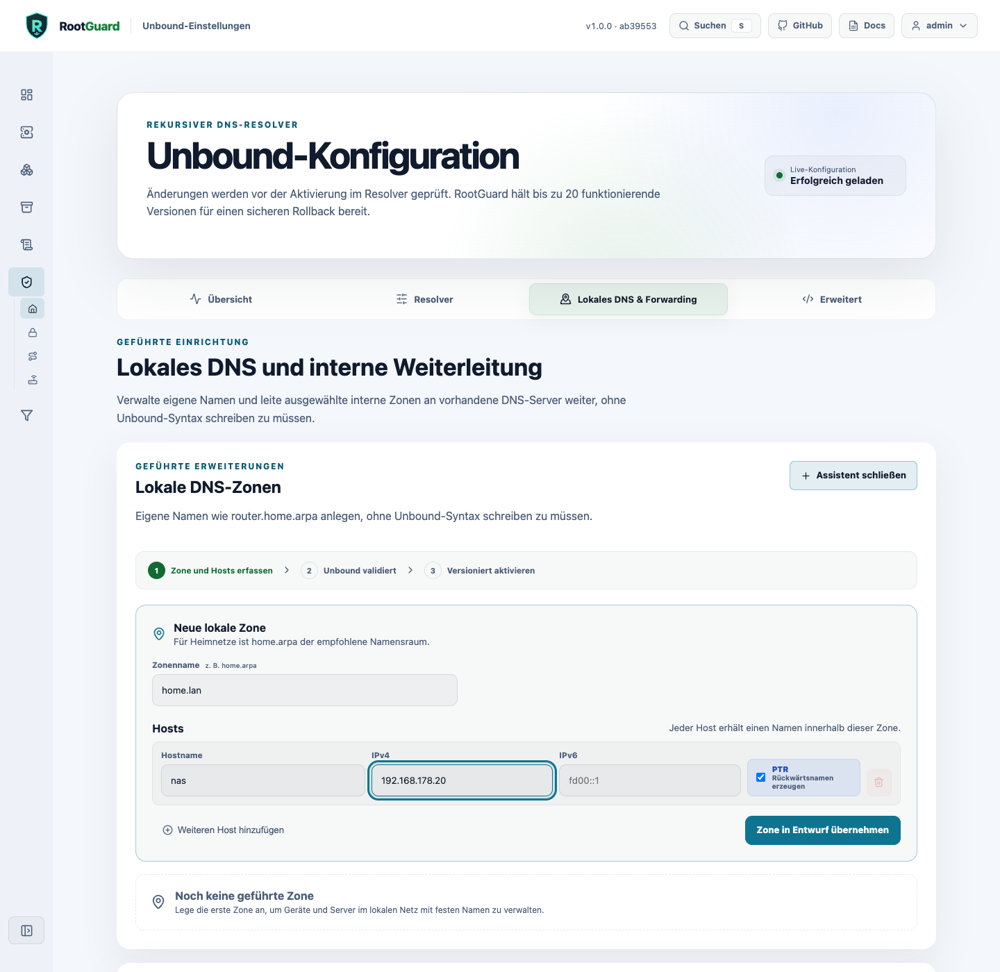

# Unbound: worked examples

Four worked-through examples for the guided Unbound settings - see the [Unbound page](../webgui/unbound.md) for the concepts behind them.

## Local DNS zones

The guided assistant under **Unbound → Local zones** creates A, AAAA, and CNAME records for devices on your network without writing any Unbound syntax by hand.

**Goal:** a zone `home.lan` with three hosts:

| Host | IPv4 | IPv6 | Derive PTR |
| --- | --- | --- | --- |
| `nas.home.lan` | `192.168.178.20` | – | yes |
| `printer.home.lan` | `192.168.178.30` | – | yes |
| `ap1.home.lan` | `192.168.178.40` | `fd00::40` | yes |



1. Open **Unbound → Local zones** and create the zone `home.lan`.
2. Add one entry per host with its name and address(es).
3. Enable "Derive PTR record" per host. RootGuard automatically derives the matching reverse zone - provided the address is unambiguous across all guided zones.
4. Review the change preview, then activate. RootGuard runs `unbound-checkconf` against the effective configuration before anything goes live.

```shell
dig @192.168.178.10 nas.home.lan A
dig @192.168.178.10 -x 192.168.178.20
```

!!! note "Limits of the guided surface"
    Per-host TTL and more complex CNAME chains are deliberately out of scope for this guided surface ([issue #131](https://github.com/foxly-it/rootguard/issues/131)) - use expert mode for those.

## Conditional forwarding

Conditional forwarding sends queries for specific internal zones to your own DNS servers instead of resolving them recursively through the public root hierarchy.

**Goal:** forward the zone `corp.example` to two ordered servers: `10.0.0.53` (primary), `10.0.0.54` (secondary).

1. Open **Unbound → Conditional Forwarding** and create the zone `corp.example`, with both targets in this order.
2. RootGuard verifies both targets **live against the running Unbound container**: activation only unlocks once the zone is answered by a target with `NOERROR` and a valid SOA record.
3. Optional opt-ins, each separately visible: recursive fallback, allow unsigned answers (`domain-insecure`), allow private RFC1918 answers.
4. Activation goes through the same preview, checkconf, versioning, and rollback pipeline as any other Unbound change.

```shell
dig @192.168.178.10 host.corp.example A
```

!!! warning "Loop detection"
    RootGuard refuses targets that would point back at RootGuard itself, AdGuard Home, or another already-configured forwarding zone.

## Importing devices from your FRITZ!Box

Instead of creating every host manually, RootGuard can adopt known devices directly from your FRITZ!Box (TR-064). Credentials are only needed if your FRITZ!Box requires a login.

1. Open **Unbound → Local zones → Import from FRITZ!Box** and enter the FRITZ!Box address (e.g. `192.168.178.1`).
2. RootGuard queries the device list and shows a **draft** with hostname, detected addresses, and conflicts.
3. Individually select which devices to adopt. Nothing is imported automatically; hostnames can be renamed before adoption.
4. Adopted hosts go through the same preview, checkconf, and activation pipeline as manually created local zones.

**Alternative without a FRITZ!Box:** reverse-DNS discovery via an explicit CIDR prefix (e.g. `192.168.178.0/24`) - only private IPv4/unicast IPv6 prefixes, max. 256 addresses in total, 16 parallel lookups sharing a 15-second deadline.

!!! note "Privacy"
    FRITZ!Box credentials are used server-side only, for that one lookup - never stored in the browser, never logged.

## Private domains and reverse DNS

RootGuard decides independently, for each of the three private RFC1918 ranges (`10/8`, `172.16/12`, `192.168/16`), how reverse lookups are handled: **NXDOMAIN** (default, safe) or **transparent public fallback** (with a visible warning before activation).

**Example:** deliberately letting `192.168.178.0/24` resolve publicly while leaving `10/8` and `172.16/12` on NXDOMAIN:

1. Open **Unbound → Private Domains**.
2. For `192.168/16`, explicitly choose "Transparent fallback".
3. Confirm the warning and activate - goes through the same preview and checkconf verification as any other Unbound change.

If you instead just want `192.168.178.20` to resolve as `nas.home.lan`, this is the wrong place for that - see [Local DNS zones](#local-dns-zones) above: derived PTR records work independently of this range-wide setting.
