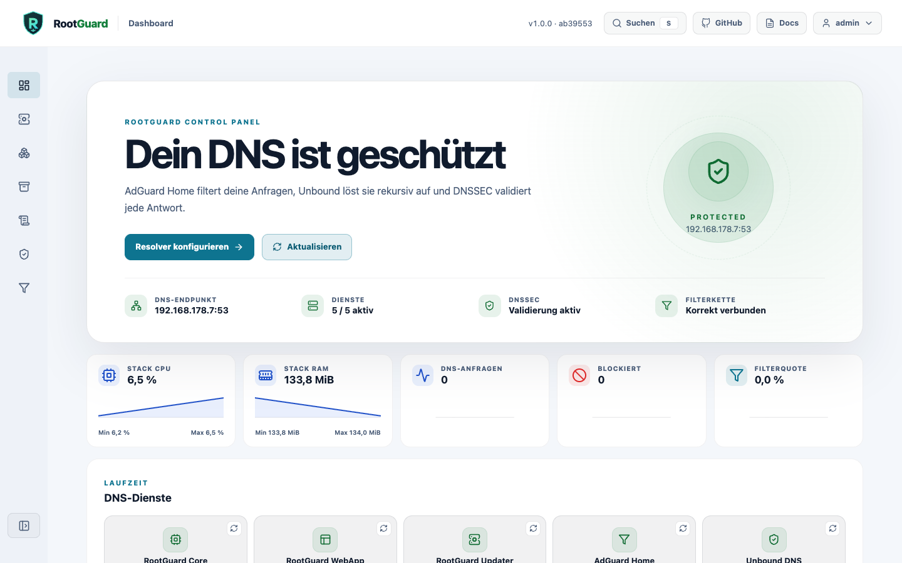
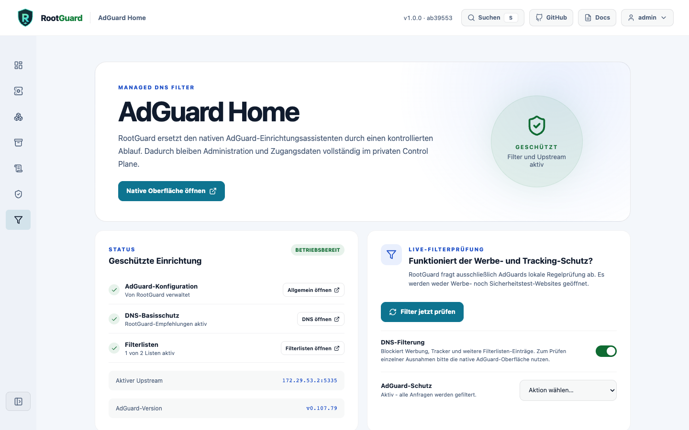
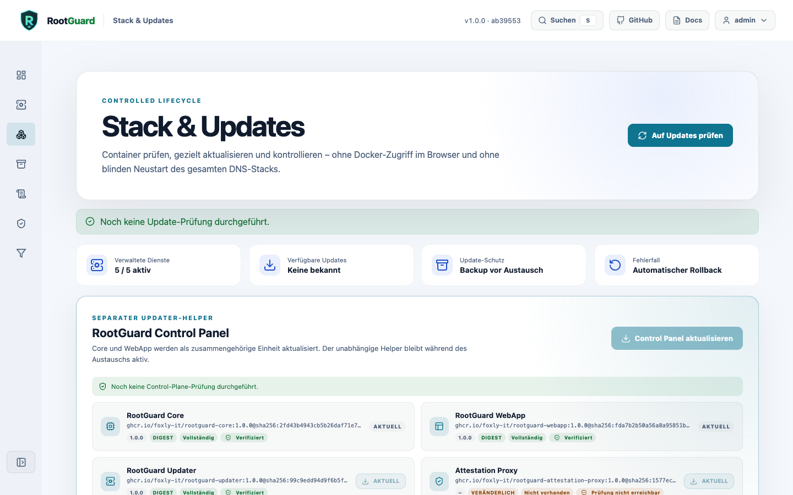
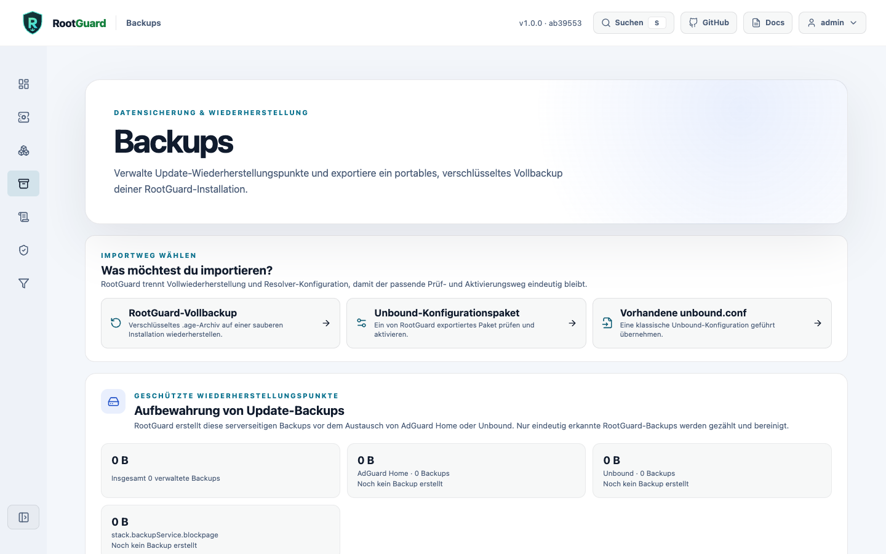
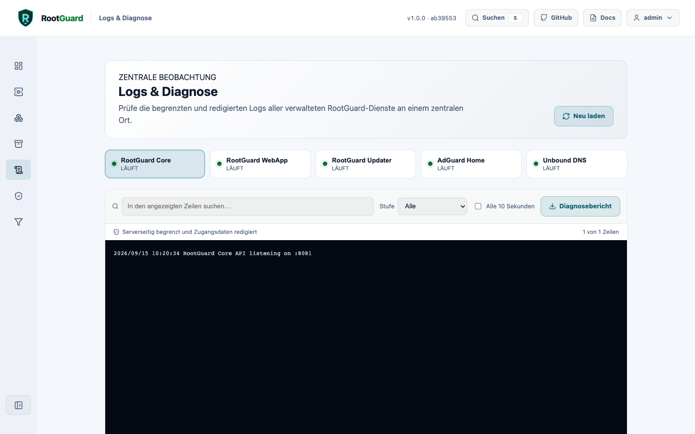

# Interface sections

| Section | Description |
| --- | --- |
| **Dashboard** | Installation, DNS endpoint, services, DNSSEC, and connection chain plus real CPU/memory and aggregated AdGuard metrics at a glance. |
| **Setup** | Network preflight and persistent AIO deployment progress. |
| **Stack & Updates** | Service state, safe updates, and history remain immediately visible; technical release details are collapsible. |
| **Backups** | Restore points, encrypted export, and clean-install full recovery. |
| **Logs & Diagnostics** | Central searchable logs for every managed service with local filtering. |
| **Unbound** | Profiles, guided settings, zones, live configuration and directives - see [its own page](webgui/unbound.md). |
| **AdGuard Home** | RootGuard status and protected access to the native AdGuard interface. |



## Live metrics

The dashboard aggregates CPU and memory usage only for the five explicitly allowlisted RootGuard containers. Core also uses AdGuard Home's internally authenticated API to read total DNS queries and blocked requests and derives the filter rate. Query names and client data do not leave AdGuard. The display refreshes every ten seconds.

## AdGuard Home: protected native administration

AdGuard Home receives no public administration port. RootGuard runs the official setup internally, stores generated credentials in Core's protected volume, and exposes the interface only through `/adguard-ui/` behind the authenticated WebApp.



!!! note "Upstream protection"
    RootGuard expects Unbound at the fixed `172.29.53.2:5335` endpoint and verifies this chain after startup and updates.

**Blockpage:** instead of AdGuard's generic default response, a dedicated RootGuard-branded page explains why a domain was blocked, including the domain, timestamp, and client IP. Setup enables AdGuard's `blocking_mode: custom_ip` automatically and can be turned off via a Setup toggle. Because a DNS-level blocking address cannot present a valid TLS certificate for arbitrary blocked domains, the page only appears over HTTP - HTTPS requests instead show the browser's own certificate warning.

## Updates & rollback



**AdGuard Home, Unbound, and the block page:** Core pulls only configured target images, compares actual image IDs, backs up persistent service paths, and replaces exactly one service. DNS, DNSSEC, and upstream are then verified. Failures trigger data and image rollback.

**Core and WebApp:** the separate updater remains alive during replacement. It updates Core and WebApp only as a pair, verifies both image IDs and health endpoints, and pins both previous images on failure.

!!! warning "Updating from 0.1.0-beta.14 or earlier"
    Core versions up to and including 0.1.0-beta.14 don't automatically detect 1.0.0 as an available update. Existing installations on that version need a one-time manual pointer to the new release:

    ```shell
    docker exec rootguard-core wget -qO- \
      --header="Authorization: Bearer $ROOTGUARD_API_TOKEN" \
      --header="Content-Type: application/json" \
      --post-data='{"target_images":{"core":"ghcr.io/foxly-it/rootguard-core:1.0.0","webapp":"ghcr.io/foxly-it/rootguard-webapp:1.0.0"}}' \
      http://updater:8082/api/control-plane/update
    ```

**History and bounded cleanup:** the Stack Center persistently retains up to 50 update, failure, rollback, and cleanup events. Internal AdGuard and Unbound update backups are limited per service to a configurable 2-50 restore points (default 5). For external recovery, the Backups page creates a passphrase-encrypted age-v1 full backup with a versioned manifest and SHA-256 checksums.

!!! note "Immutable release images"
    The public release stack combines readable version tags with verified multi-architecture digests. Docker therefore starts the exact published artifact even if a tag were changed later:

    ```ini title=".env"
    ROOTGUARD_CORE_UPDATE_IMAGE=ghcr.io/foxly-it/rootguard-core:1.0.0@sha256:2fd43b4943cb5b26daf71e79eb9d6bec8e42d2b1e07d40ab7ed425b065113c41
    ROOTGUARD_WEBAPP_UPDATE_IMAGE=ghcr.io/foxly-it/rootguard-webapp:1.0.0@sha256:fda7b2b50a56a8a95851b59642a6543e76f8bb4dc4104df1b249916f3da2c45e
    ```

## Backups

Restore points for AdGuard Home and Unbound are created automatically before every update. For external recovery, this page produces a passphrase-encrypted age-v1 full backup; the same import wizard distinguishes between a full backup, an exported Unbound configuration bundle, and an existing `unbound.conf`.



## Logs & diagnostics

Central searchable logs for all five managed services, with local filtering, optional auto-refresh, and a redacted diagnostic report you can download.


